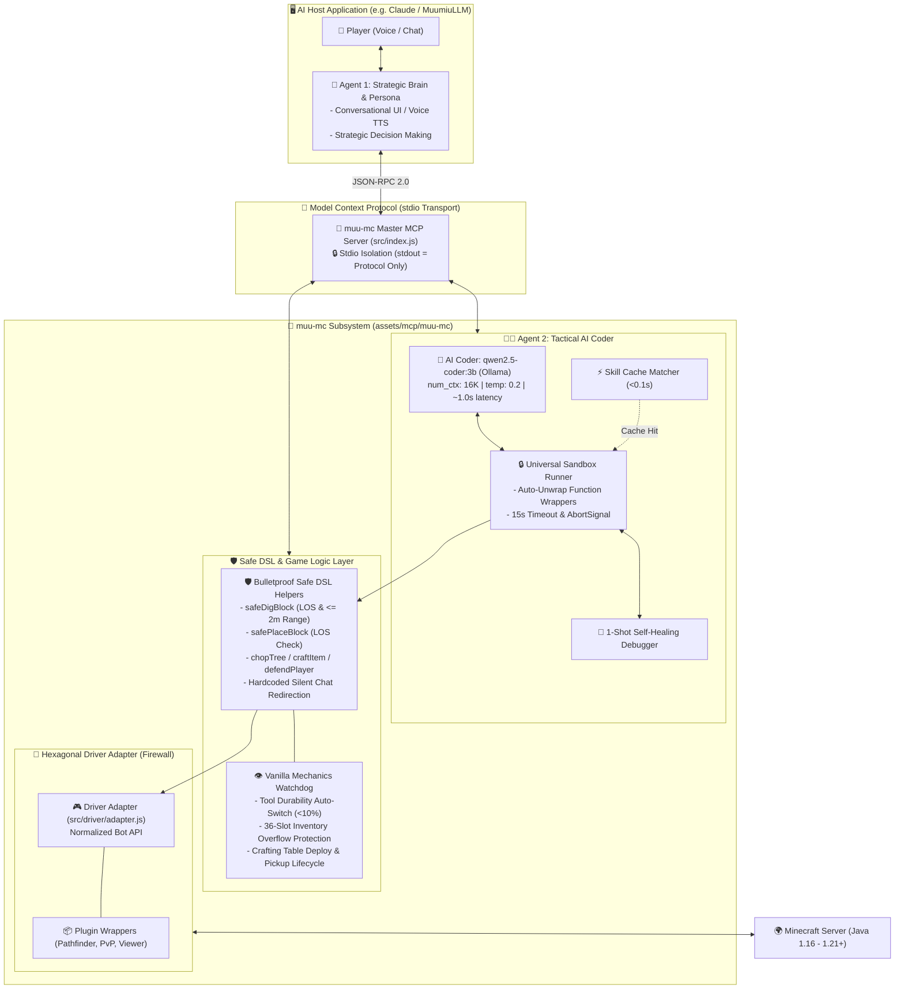

# 🎮 `muu-mc` — High-Performance Bulletproof Minecraft Java MCP Subsystem

> **Autonomous AI Companion & Tool Subsystem for Minecraft Java Edition (1.16 – 1.21+)**  
> Powered by [Model Context Protocol (MCP)](https://modelcontextprotocol.io), [Mineflayer v4.38.0](https://github.com/PrismarineJS/mineflayer), and **Dual-Agent Tactical Architecture**.

[](https://nodejs.org/)
[](https://github.com/modelcontextprotocol)
[](https://github.com/PrismarineJS/mineflayer)
[](https://minecraft.net)
[](https://ollama.com)

---

## 📖 Overview

**`muu-mc`** is a standalone, production-grade MCP Server designed to connect Large Language Models (LLMs) to **Minecraft Java Edition**. It transforms any MCP-compatible AI Assistant (such as Claude Desktop, MuumiuLLM, Cursor, or custom agents) into a fully capable in-game companion that can navigate, mine, craft, build, defend, and explore autonomously.

### 🌟 Key Highlights
- 🧠 **Dual-Agent Architecture**: High-level strategic reasoning and conversational dialog are separated from real-time JavaScript code generation and game physics.
- 🛡️ **Hexagonal Driver Adapter (Zero-Breakage Guarantee)**: Complete decoupling layer between upstream Mineflayer APIs and the AI Coder. Upgrading Mineflayer or switching Minecraft versions never breaks your skill library.
- ⚡ **Ultra-Fast Skill Cache (<0.1s)**: Repeated common tasks execute from parameterized skill cache in sub-100ms without consuming LLM tokens.
- 🔒 **Universal Sandbox & 1-Shot Self-Healing**: Safe VM execution with auto-unwrap for Markdown and wrappers, 15s timeout guard, and automatic 1-shot runtime error repair.
- 💾 **Two-Tier Atomic Memory**: Multi-world landmark tracking (`landmarks.json`) and chest inventories (`chests.json`) indexed by server IP/port with crash-proof atomic writes (`.tmp ➔ rename`).
- 🤖 **Autonomous Proactive Engine**: Automatic hunger management, nighttime bed sleeping, sapling replanting, and social gaze with **0.01s Instant Preemption** when player commands arrive.
- 🎙️ **Simple Voice Chat & Headless Companion Integration**: Real-time bi-directional voice chat bridge via `MuuVoiceBridge` (port 25570), physical action grounding, and support for the lightweight headless runner (`run_game.sh`).
- 🌐 **Embedded 3D WebGL Viewer**: Live first-person and third-person orbital camera stream directly in your web browser (`http://127.0.0.1:3007`).

---

## 🏗️ System Architecture



---

## 🛡️ 8 Engineering Safeguards

| Safeguard | Problem Solved | Implementation Detail |
|---|---|---|
| **1. Driver Adapter Firewall** | Mineflayer version updates break bot code | [`src/driver/adapter.js`](src/driver/adapter.js) wraps and normalizes all Mineflayer calls. AI never sees the raw bot object. |
| **2. AI Sandboxing & Auto-Unwrap** | LLM outputs markdown fences or bad wrappers | [`src/coder/sandbox.js`](src/coder/sandbox.js) cleans markdown, unwraps `async function task(...)`, and executes in an isolated scope. |
| **3. Capped Context Window (16K)** | High latency and VRAM exhaustion | Capped at 16K (`num_ctx: 16384`) on `qwen2.5-coder:3b`, consuming ~4.0 GB VRAM with **0.8s – 1.5s** generation speed. |
| **4. Distance <= 2m & Line-of-Sight** | Bot fails digging/placing due to Out-of-Range errors | [`src/coder/dsl.js`](src/coder/dsl.js) automatically pathfinds to <= 2m and faces the target block before any dig/place action. |
| **5. Silent Chat Redirection** | AI spamming in-game public chat | `dsl.chat()` is hardcoded to redirect to `logger.info` internally. Only explicit `muu_mc_chat_in_game` tool calls broadcast in-game. |
| **6. Strict Stdio Stream Isolation** | Non-JSON log output crashing the MCP transport | `process.stdout.write` filter intercepts non-JSON strings and routes them to `stderr` and `logs/muu_mc.log`. |
| **7. Step Timeout & 1-Shot Debugger** | Bot freezing or getting stuck | 15s execution timeout via `AbortController`. If an exception occurs, [`src/coder/debugger.js`](src/coder/debugger.js) repairs code in 1-Shot. |
| **8. Two-Tier Atomic Memory** | Memory corruption on sudden disconnects | [`src/memory/world_memory.js`](src/memory/world_memory.js) writes to `.tmp` files before atomic renaming (`fs.renameSync`). |

---

## 🔌 MCP Tools Reference (7 Tools)

### 1. `muu_mc_execute_task`
Instructs the bot to perform an autonomous Minecraft task. Uses Skill Cache for instant execution or writes and tests new JavaScript via Agent 2.
```json
{
  "name": "muu_mc_execute_task",
  "arguments": {
    "task": "ตัดไม้โอ๊ค 5 บล็อกแล้วปลูกต้นกล้าคืน",
    "context_hint": "มีขวานเหล็กอยู่ในกระเป๋า"
  }
}
```

### 2. `muu_mc_quick_action`
Executes an instantaneous basic physical action (<0.1s) without invoking the LLM.
- **Actions**: `"follow"`, `"stop"`, `"look_at"`, `"jump"`, `"come_here"`
```json
{
  "name": "muu_mc_quick_action",
  "arguments": {
    "action": "follow",
    "target_player": "Nice2MU"
  }
}
```

### 3. `muu_mc_get_game_state`
Fetches real-time telemetry from the Minecraft world.
- **Detail Levels**: `"summary"`, `"full"`, `"inventory_only"`, `"nearby_blocks"`
```json
{
  "name": "muu_mc_get_game_state",
  "arguments": {
    "detail_level": "full"
  }
}
```

### 4. `muu_mc_chat_in_game`
Sends a public chat message to the in-game Minecraft server chat.
```json
{
  "name": "muu_mc_chat_in_game",
  "arguments": {
    "message": "มูมิวตัดไม้มาให้ครบ 5 ท่อนแล้วค่า!"
  }
}
```

### 5. `muu_mc_save_landmark`
Saves custom or current coordinates as a persistent named landmark for the active server world.
```json
{
  "name": "muu_mc_save_landmark",
  "arguments": {
    "name": "MainBase",
    "description": "บ้านหลักริมทะเลสาบ",
    "coords": { "x": 120.5, "y": 64.0, "z": -300.2 }
  }
}
```

### 6. `muu_mc_list_skills`
Returns the catalog of tested, reusable JavaScript skills in the local library.
```json
{
  "name": "muu_mc_list_skills",
  "arguments": {
    "category": "gathering"
  }
}
```

### 7. `muu_mc_manage_memory`
Inspects landmarks, chest registries, or error reflections.
```json
{
  "name": "muu_mc_manage_memory",
  "arguments": {
    "action": "get_landmarks"
  }
}
```

---

## 📡 MCP Resources Reference (3 URIs)

- `minecraft://status`: Returns real-time health, food, position, and status in JSON.
- `minecraft://skills`: Returns all registered skills in the skill library.
- `minecraft://landmarks`: Returns all saved landmarks for the active server world.

---

## 📦 Directory Structure

```text
assets/mcp/muu-mc/
├── package.json                         # Dependencies & npm scripts
├── config/
│   ├── aiprovider.yaml                  # Agent 2 Coder config (Ollama qwen2.5-coder:3b)
│   └── minecraft.yaml                   # Server IP, port, bot username & 3D Viewer config
├── src/
│   ├── index.js                         # Master MCP Entrypoint (StdioServerTransport)
│   ├── config/loader.js                 # YAML configuration parser
│   ├── driver/                          # 🔌 Hexagonal Driver Adapter Firewall
│   │   ├── adapter.js                   # Normalized Bot API
│   │   ├── plugin_wrappers.js           # Wrappers for Pathfinder, PvP, CollectBlock, Viewer
│   │   └── registry_resolver.js         # Dynamic minecraft-data item/recipe resolver
│   ├── bot/
│   │   ├── client.js                    # Bot lifecycle & auto-reconnect manager
│   │   ├── logger.js                    # Stdio-isolated stderr & file logger
│   │   ├── state.js                     # Real-time world state scanner
│   │   ├── watchdog.js                  # Tool durability & 36-slot inventory watchdog
│   │   └── autonomous_engine.js         # Idle proactive routines with 0.01s preemption
│   ├── coder/
│   │   ├── agent.js                     # Agent 2 brain (Ollama API client)
│   │   ├── sandbox.js                   # Universal Sandbox with Auto-Unwrap & 15s timeout
│   │   ├── debugger.js                  # 1-Shot Self-Healing Error Debugger
│   │   └── dsl.js                       # Safe DSL Helpers (safeDig, safePlace, chopTree, craft)
│   ├── memory/
│   │   ├── skill_manager.js             # Skill library & fast Cache Matcher (<0.1s)
│   │   ├── reflection_manager.js        # Error reflection & lesson storage
│   │   └── world_memory.js              # Multi-world landmark & chest storage (Atomic write)
│   ├── voice/
│   │   ├── voice_client.js              # WebSocket bridge client (connects to MuuVoiceBridge port 25570)
│   │   └── voice_manager.js             # Voice buffer manager & MCP notifications dispatcher
│   └── mcp/
│       ├── tools.js                     # Handlers for all MCP Tools (including Voice & Chat)
│       └── resources.js                 # Handlers for MCP Resources
├── data/
│   ├── skills/                          # 5 Starter Skills (follow, collect, craft, defend, sleep)
│   ├── skills_registry.json             # Skill catalog
│   ├── error_reflection.json            # Error reflection lessons
│   └── player_safety_rules.json         # No-friendly-fire & safety rules
└── tests/
    ├── run_all_tests.js                 # Master test suite runner
    ├── test_phase1.js                   # Driver Adapter & DSL unit test
    ├── test_phase2.js                   # Sandbox & Live Ollama Coder test
    ├── test_phase3.js                   # Two-Tier Memory unit test
    └── test_phase5.js                   # Autonomous Engine & Preemption test
```

---

## 🚀 Getting Started

### 1. Prerequisites
- **Node.js**: `v18.0.0` or higher (tested on Node v22)
- **Ollama**: Installed and running locally
  ```bash
  ollama pull qwen2.5-coder:3b
  ```
- **Minecraft Server**: Java Edition (1.16 – 1.21+)

### 2. Installation
```bash
# Clone the repository
git clone https://github.com/Nice2MU/muu-mc.git
cd muu-mc

# Install npm dependencies
npm install
```

### 3. Configuration
Edit `config/minecraft.yaml` to point to your Minecraft server:
```yaml
server:
  host: "127.0.0.1"
  port: 25565
  version: false # false = auto-detect server version dynamically (1.16 - 1.21+)
  auth: "offline" # "offline" or "microsoft"

bot:
  username: "Muumiu"
  view_distance: "far"

viewer:
  enabled: true
  port: 3007
  first_person: true
```

### 4. Running the Master Test Suite
Verify that all unit tests and live AI generation pass:
```bash
npm test
```

---

## ⚙️ Connecting to MCP Hosts

### A. Claude Desktop (`claude_desktop_config.json`)
Add the following to your Claude Desktop configuration:
```json
{
  "mcpServers": {
    "muu_mc": {
      "command": "node",
      "args": ["/ABSOLUTE/PATH/TO/muu-mc/src/index.js"]
    }
  }
}
```

### B. MuumiuLLM (`config/mcp/mcp_servers.yaml`)
```yaml
servers:
  muu_mc:
    enabled: true
    transport: "stdio"
    command: "node"
    args: ["assets/mcp/muu-mc/src/index.js"]
    env: {}
    timeout: 60.0
```

---

## 🌐 Web 3D Viewer Controls
When `viewer.enabled: true`, open your web browser at **`http://127.0.0.1:3007`**:
- **First-Person View**: Default camera locked to the bot's eyes.
- **Left-Click + Drag**: Rotate camera 360 degrees around bot.
- **Scroll Wheel**: Zoom in/out for third-person orbital perspective.
- **Right-Click + Drag**: Pan camera across the world.

---

## 🏆 Battle-Tested Production Safeguards

1. **🎯 0.5s Fast Digging & True Raycast Physics (`src/driver/adapter.js`)**:
   - Targets exact block centers (`x+0.5, y+0.5, z+0.5`) without artificial vertical offsets.
   - Digs stone and deepslate in 0.5s–0.9s per block. Requires proximity ($1.8\text{m} - 2.0\text{m}$) before digging to eliminate ghost swings.
2. **🪵 Persistent Workstation Deployment (`src/coder/dsl.js`)**:
   - Eliminates the repeated place-and-break cycle on Crafting Tables and Furnaces. Stations remain on the ground and are dynamically reused within 12m.
3. **💧 Dynamic Aquifer & Lava Avoidance (`src/coder/dsl.js`)**:
   - Detects liquids in front before digging staircase steps and rotates 90° to dry orthogonal stone headings (`+Z`, `-Z`, `-X`) to prevent drowning.
4. **🗑️ Smart 180° Backward Trash Ejection & Blacklist (`src/driver/adapter.js`)**:
   - Caps construction blocks (`cobblestone`, `cobbled_deepslate`, `dirt`) at 32 items.
   - Rotates 180° backward to toss junk away from the travel path, steps 1.5m forward, and blacklists trash entity IDs to prevent re-picking.
5. **📦 Active Loot Vacuum Sweep (`src/coder/dsl.js`)**:
   - Sweeps and vacuums all dropped item entities within 10m of mined ore veins into inventory.
6. **💎 Diamond Discovery Reflex & Priority Rush (`src/bot/autonomous_engine.js`)**:
   - Instantly records spotted diamond coordinates to `discovered_ores.json`.
   - Enforces `iron_pickaxe` / `diamond_pickaxe` requirement before breaking diamond ores (preventing stone pickaxe 0-drop deletion) and rushes diamond mining as the top priority.
7. **⛏️ Connected Vein BFS Excavator (`src/coder/dsl.js`)**:
   - Recursively extracts 26-neighbor connected ore clusters until 100% cleared.
8. **🐕 Non-Interfering Digging Watchdog (`src/bot/autonomous_engine.js`)**:
   - `if (adapter._isDigging) return;` guard prevents false anti-stall interruptions while swinging tools.
9. **💥 Creeper Hit-and-Run Sprint Evasion (`src/driver/adapter.js`)**:
   - Executes dynamic hit-and-run evasion against creepers: strikes with knockback, then immediately sprint-jumps backward 6–7 blocks with an impulse velocity boost (`0.28`). Cancels the creeper's fuse and avoids explosions completely.
10. **🧲 Auto-Vacuum Step on Dig (`src/coder/dsl.js`)**:
    - Bridges the gap between player mining reach (3.8m–4.5m) and Minecraft's item suction radius (1.5m). Upon breaking any block, the bot steps forward within 0.8m (`gotoXZ`) to vacuum all drops straight into inventory.
11. **🛡️ Deep Ore Hazard Assessment (`isOreSafeToHarvest` in `src/coder/dsl.js`)**:
    - Pre-evaluates ore veins before mining. Automatically bypasses submerged/underwater ores (preventing drowning), lava/fire-adjacent blocks (preventing item incineration), mob camps (>=2 hostiles or <=12 HP), and overhead gravel/sand suffocation traps.
12. **🕳️ Pro-Standard 2x1 Shaft Seam-Straddling (`src/coder/dsl.js`)**:
    - Positions precisely on the center border seam (0.6m hitbox straddles Block A and Block B). Digs Block A while supported by Block B, checks for lava/drop hazards, then digs Block B to drop 1 level safely without ever falling into caverns.
13. **🚇 Horizontal Strip Mining & Balanced Descent Depths (`src/coder/dsl.js`, `src/bot/autonomous_engine.js`)**:
    - Sets default staircase mining depth to the optimal Iron layer (`Y=16`) instead of plunging to Bedrock (`Y=-54`). Dispatches straight 1x2 Strip Mining tunnels (18 blocks long) and Fishbone (Branch) mining at optimal depth.
14. **🦘 Vanilla Auto-Jump Leap & Water Buoyancy Engine (`src/driver/plugin_wrappers.js`)**:
    - Elevates `stepHeight` to `1.2` and applies forward leap velocity (`0.24`) with jump lock during Pathfinder movements to effortlessly scale 1-block steps without collision freezing. Holds continuous buoyancy jump while in water to prevent drowning.


